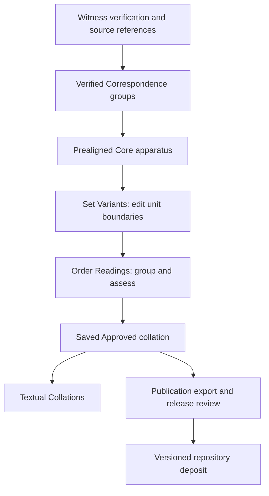

# Research workflow

## Witness verification and correspondence

The [witness Workbenches](workbenches.md) prepare the textual evidence before alignment. Researchers check electronic starting texts against the relevant manuscript or printed edition. Workbenches record verification, corrections, local variants and their sources. Verification sources and electronic starting texts remain distinct provenance elements.

Correspondence groups establish which selected textual spans are to be compared. They preserve source-token references and explicit absence states. A witness not preserved at a passage is not silently treated as an omission. The [multilingual comparison guide](multilingual-comparison.md) explains how these groups become Core units.

## Editing in Core

The mapped apparatus enters Core through its editorial workflow, but does not use Core's automatic regularisation rules to establish cross-language agreement. Source changes belong in the Workbenches; alignment changes belong in Correspondence. Reload Correspondence reconstructs the initial apparatus from those verified records.

**Set Variants** is used to establish editorial units, including combining adjacent units. **Order Readings** adds reading assessment: complete or partial agreement, distinct groups, primary/secondary/literary/uncertain judgments, secondary explanations and permitted Hebrew reconstructions.

The assessment is attached to the edited Core state. Its recorded basis identifies the unit and readings that were assessed; changes to that basis require review. Reconstructions remain distinct from notes and attested text.

## Approval and release

A saved Approved collation supplies the current view in Textual Collations. Approval records an editorial decision within the project, rather than a claim that an interpretation cannot be revised.

Repository publication is a separate release step. Dataset creators review authorship, version, source references, rights and scientific content before deposit. Research exports contain fuller working records; publication exports contain the scholarly projection and its documented sources. Verse export is available per Approved passage. Chapter export becomes available from the final verse when every verse has an Approved save in the same text mode.

Deposited versions provide stable citations; the public reader reflects current Approved work. Neither export is a complete backup of the editing service.
