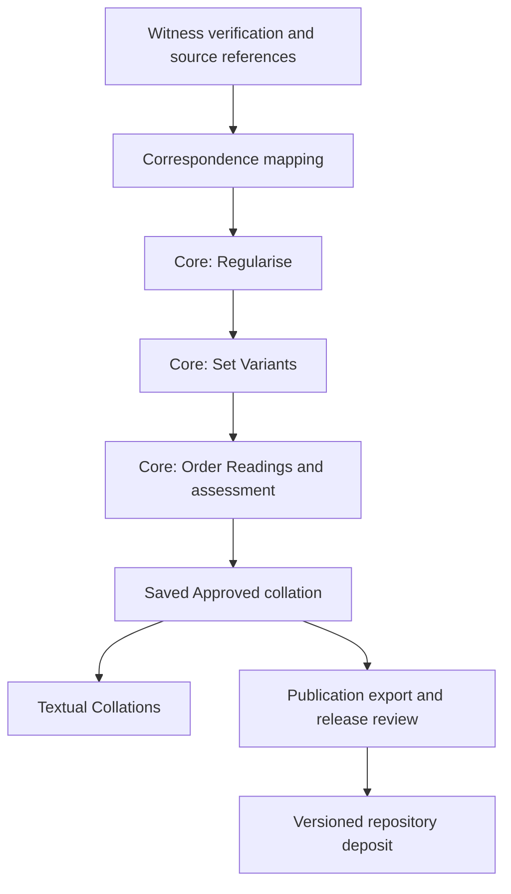

# Research workflow

## Verify the witnesses

Researchers check electronic starting texts against the relevant manuscript or printed edition. Workbenches record verification, corrections, local variants and their sources. A verification edition and an electronic starting text are different provenance elements; checking the former does not erase the latter.

## Map correspondence

Correspondence records relate the selected witness material to the passage. Local variants retain their scope and source references. A witness not preserved at a passage is not silently treated as an omission.

## Edit the collation

Regularisation handles comparison rules. Set Variants handles the boundaries and combination of units. Order Readings includes research grouping and characterization. The assessment is attached to the edited Core state, rather than to a separately regenerated set of units.

Researchers can record complete agreement, partial agreement and distinct reading groups. Groups can be assessed as primary, secondary, literary or uncertain. Secondary readings can carry an explanation and a relationship to the relevant group. Permitted Hebrew reconstructions are separate from notes and witness transcriptions.

## Approve and publish

Saving an Approved collation makes its current projection available in Textual Collations. Repository publication is a separate release step: authorship, version, source references and rights information are reviewed before deposit.

Research exports contain fuller working records. Publication exports contain the scholarly projection of the Approved collation and its documented sources. Neither the live reader nor a repository deposit should be confused with a backup of the editing service.
